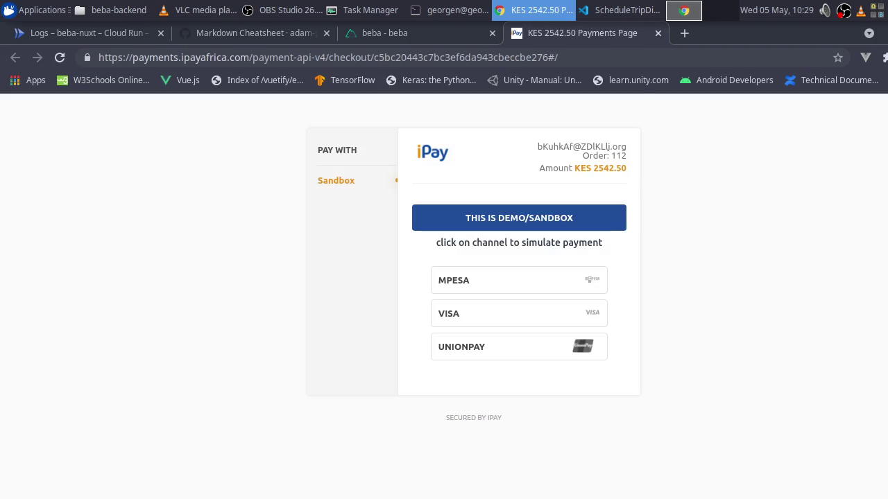

# Beba Fleet Management System

_Beba_ is the swahili word for 'carry' or 'transport'.This is the frontend for a concept fleet management system.
The functions are minimal:
* Show a google maps view with current locations of vehicles being monitored
* Browse through a list of drivers and see each driver's details
* Browse through a list of vehicles and see each vehicle's details
* Browse through all trips made in the past as well as future scheduled ones
* Schedule a trip
* Cancel a trip
* send email notification to a driver once scheduled for a trip
  
## Technologies Used 
The web app is a Vuejs application built using the Nuxt.js framework and Typescript.
- Vuetify Material Components was used for the UI
- Google Maps Api was used to display the map.
- [GRPC Web](https://github.com/improbable-eng/grpc-web) was used to make requests to the backend ([https://github.com/ndirangug/beba-backend](https://github.com/ndirangug/beba-backend)) a Golang grpc service.
- [Emailjs](https://www.emailjs.com/) sdk was used to send emails to drivers
- [Ipay Africa](https://ipayafrica.com/api/) was used to process payments
- Docker was  used to continerize the application for possible deployment to Google Cloud Run.


## Screenshots
* Home
    
* All Driver
     
* Driver Details
   
* All Vehicles
     
* Vehicle Details
     
* Schedule Trip
     
* Disburse Funds To Driver
     

## Video Demo
<div style="padding:56.25% 0 0 0;position:relative;"><iframe src="https://player.vimeo.com/video/545373763?badge=0&amp;autopause=0&amp;player_id=0&amp;app_id=58479" frameborder="0" allow="autoplay; fullscreen; picture-in-picture" allowfullscreen style="position:absolute;top:0;left:0;width:100%;height:100%;" title="Beba Fleet Management System Demo"></iframe></div>

<script src="https://player.vimeo.com/api/player.js"></script>

## Build Setup

```bash
# install dependencies
$ yarn install

# serve with hot reload at localhost:3000
$ yarn dev

# build for production and launch server
$ yarn build
$ yarn start

# generate static project
$ yarn generate
```

